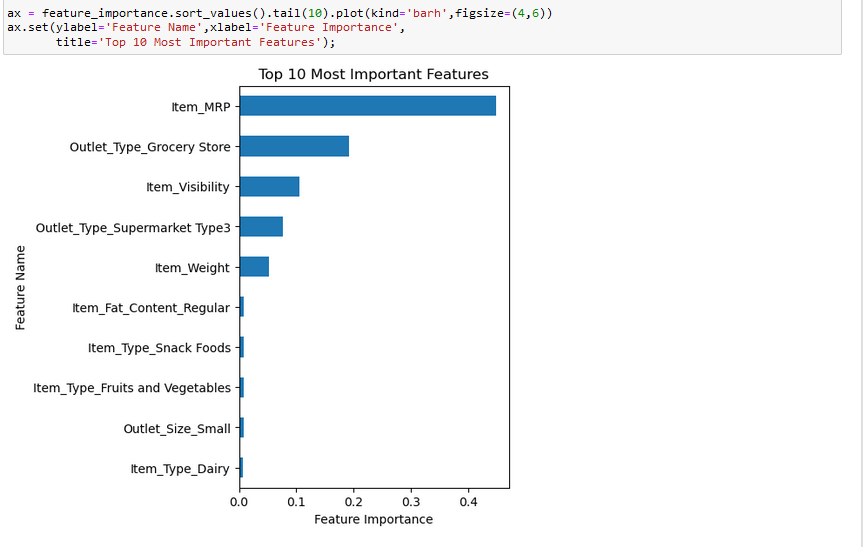

# Project 1-Revisited
 
## The coefficients provide the following insights into which features positively or negatively influence product sales:
### Coefficients that Positively Influence Product Sales:
    - Outlet_Type_Supermarket Type3 increases the sales by 1524.724
    - Item_Type_Seafood increases the sales by 302.602
    - Outlet_Type_Supermarket Type1 increases the sales by 266.230
### Coefficients that Negatively Influence Product Sales:
    - Outlet_Type_Grocery Store decreases -1607.678
    - Item_Visibility decreases -425.370
    - Outlet_Type_Supermarket Type2 decreases the sales by -183.277
   
