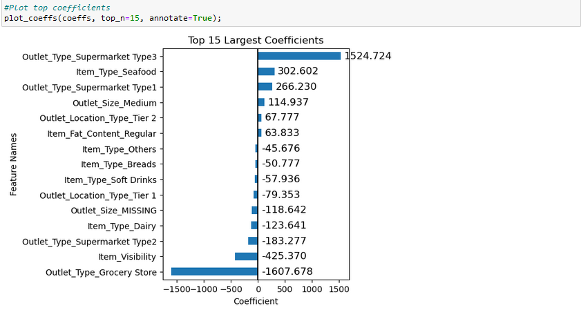
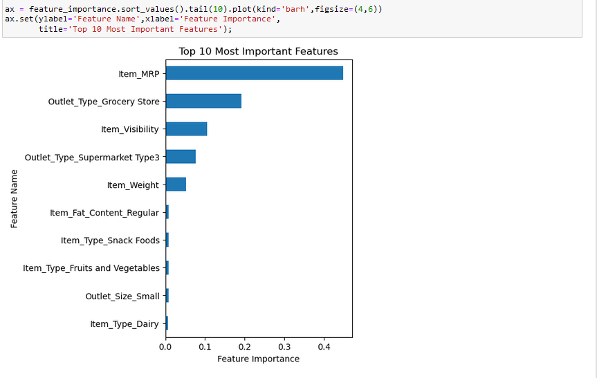
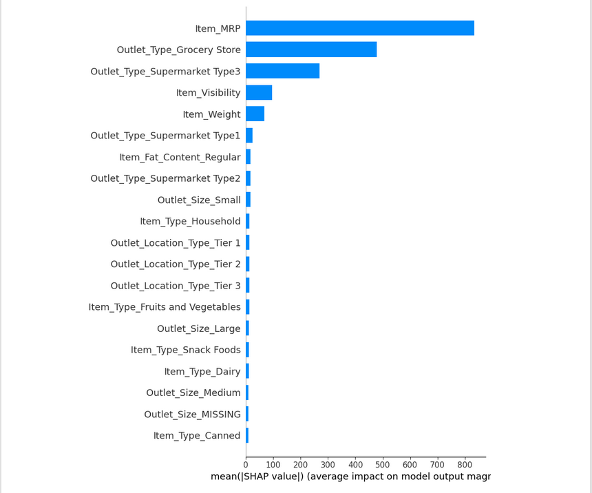
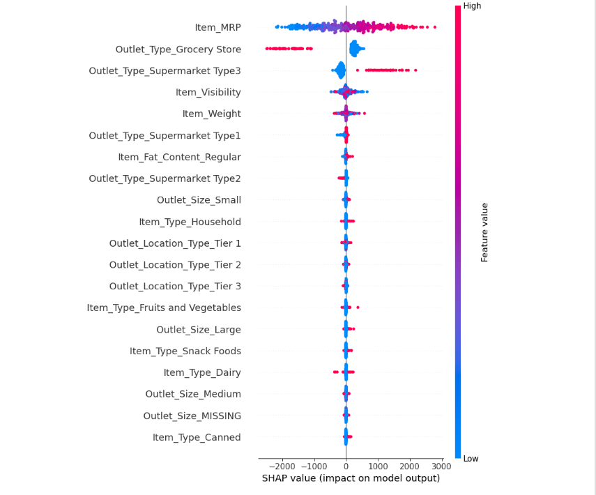

# Project 1-Revisited
 
## The coefficients provide the following insights into which features positively or negatively influence product sales:
### Coefficients that Positively Influence Product Sales:
    - Outlet_Type_Supermarket Type3 increases the sales by 1524.724
    - Item_Type_Seafood increases the sales by 302.602
    - Outlet_Type_Supermarket Type1 increases the sales by 266.230
### Coefficients that Negatively Influence Product Sales:
    - Outlet_Type_Grocery Store decreases -1607.678
    - Item_Visibility decreases -425.370
    - Outlet_Type_Supermarket Type2 decreases the sales by -183.277
   
 ## The top 5 feature importances are:
    - Item_MRP
    - Outlet_Type_Grocery Store
    - Item_Visibility
    - Outlet_Type_Supermarket Type3 
    - Item_Weight
 ## comparison of most important features found by shap vs feature importance.
 
- In the assessment of feature importance, both SHAP values and our original feature importance methodology have identified a common set of influential features. However, there are notable distinctions, primarily revolving around "Outlet_Type_Supermarket Type 3" and "Item Visibility."
## The top 3 most important features 
 
- Item_MRP:
  -A higher item's Maximum Retail Price (MRP), represented by the red color, is more likely to have a positive impact on our predictive model. 
- Outlet_Type_Grocery Store :
    -In the case of this feature, you'll notice that the majority of red values are concentrated to the left of 0. This implies that when an outlet is categorized as a grocery store, it's more likely that the associated items will have lower selling prices.
- Outlet_Type_Supermarket Type 3:
    -This feature exhibits a notable concentration of red values above 0. This signifies that outlets categorized under this type tend to lead to higher sales.
