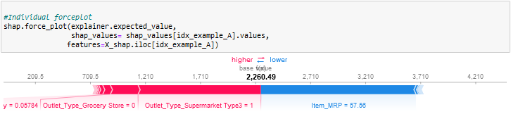
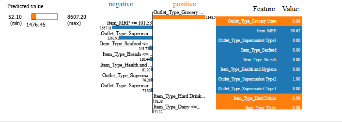

# Contact Information
- Name : Gabriel Pantoja
 ## You can reach out to me via:
- Email: [jezepantoja@gmail.com](mailto:jezepantoja@gmail.com)
# Prediction-of-product-sales
## Summary
- This project aims to analyze sales data and develop a regression model to predict item outlet sales based on various features. The dataset includes information such as item weight, item type, outlet size, and advertising spend, among others. By exploring the data and building a predictive model, valuable insights can be derived to support business decision-making and optimize sales strategies.

## Project Objectives 
1. Perform exploratory data analysis to understand the characteristics and patterns within the sales dataset.
2. Visualize relationships between different variables to identify potential correlations and trends.
3. Develop a regression model to predict item outlet sales and evaluate its performance using appropriate metrics.
4. Provide actionable insights and recommendations based on the analysis and model findings.
## Results

- The box plot showcases the distribution of item outlet sales based on different outlet sizes. It allows us to compare the sales performance across different outlet sizes, whether small, medium, or large. By examining the box plot, we can identify any variations in sales and potential differences in consumer behavior based on the size of the outlet.
   
   

- The scatter plot illustrates the relationship between item visibility and item outlet sales. We can observe the dispersion of data points, representing different products. By analyzing the scatter plot, we can infer whether there is any correlation between the visibility of products and their corresponding sales.
## Methodology
 1. Data Preprocessing: Load the dataset, handle missing values, and perform necessary data cleaning and formatting.
 2. Exploratory Data Analysis: Explore the dataset to understand its structure, distributions, and relationships between variables.
 3. Data Visualization: Create informative and visually appealing visualizations to showcase key insights and patterns.
 4. Feature Engineering: Extract relevant features and transform data as needed for modeling purposes.
 5. Model Development: Build a regression model using suitable algorithms and train it on the prepared dataset.
 6. Model Evaluation: Assess the performance of the model using appropriate regression metrics such as MAE, MSE, RMSE, and R-squared.
 7. Interpretation and Reporting: Summarize the findings, provide insights, and offer actionable recommendations based on the analysis.

## Model
- For the final model, we employed a regression approach to predict item outlet sales based on the available features. The specific details of the model, such as the algorithm used and hyperparameter tuning, are not specified in this summary. However, the model's performance can be evaluated using relevant regression metrics.

## Important Metrics:
- The model's performance can be assessed using metrics such as Mean Absolute Error (MAE), Mean Squared Error (MSE), Root Mean Squared Error (RMSE), and R-squared (R^2). These metrics quantify the accuracy, precision, and goodness of fit of the model.

## Business Problem Solution:

- Based on the model's performance metrics, we can evaluate how well the model solves the business problem of predicting item outlet sales. The lower values of MAE, MSE, and RMSE indicate that the model's predictions are closer to the actual sales figures. Additionally, a higher R-squared value implies that a significant portion of the variation in sales can be explained by the features used in the model.
- By considering these metrics, we can conclude that the model has the potential to provide reasonably accurate predictions of item outlet sales. However, it is important to assess the model's performance within the context of the specific business requirements and objectives.
  
## Recommendations:
- Utilize the developed model for sales forecasting: Employ the trained model to predict future item outlet sales based on the available features. This can assist in demand planning, inventory management, and resource allocation.
- Refine and optimize the model: Continuously evaluate and refine the model's performance using additional data and feedback. Explore advanced algorithms, feature engineering techniques, or ensemble methods to potentially improve the model's accuracy and predictive capabilities.
## Limitations & Next Steps:
- Limited feature set: The model's performance heavily relies on the available features. Consider collecting additional relevant features or external data sources to enhance the model's accuracy and capture more influential factors affecting sales.
- Data quality and completeness: Ensure the dataset is comprehensive, accurate, and up-to-date. Address any missing data or outliers that might affect the model's performance.
- Continuous monitoring and updates: Periodically reevaluate and update the model to adapt to changing market conditions, consumer behavior, or industry trends.
### For further information:
- For any additional questions or further information, please feel free to contact us at jezepantoja@gmail.com.

# Project 1-Revisited
 
## The coefficients provide the following insights into which features positively or negatively influence product sales:
### Coefficients that Positively Influence Product Sales:
    - Outlet_Type_Supermarket Type3 increases the sales by 1524.724
    - Item_Type_Seafood increases the sales by 302.602
    - Outlet_Type_Supermarket Type1 increases the sales by 266.230
### Coefficients that Negatively Influence Product Sales:
    - Outlet_Type_Grocery Store decreases -1607.678
    - Item_Visibility decreases -425.370
    - Outlet_Type_Supermarket Type2 decreases the sales by -183.277
   
 ## The top 5 feature importances are:
    - Item_MRP
    - Outlet_Type_Grocery Store
    - Item_Visibility
    - Outlet_Type_Supermarket Type3 
    - Item_Weight
 ## comparison of most important features found by shap vs feature importance.
 
- In the assessment of feature importance, both SHAP values and our original feature importance methodology have identified a common set of influential features. However, there are notable distinctions, primarily revolving around "Outlet_Type_Supermarket Type 3" and "Item Visibility."
## The top 3 most important features 
 
- Item_MRP:
  -A higher item's Maximum Retail Price (MRP), represented by the red color, is more likely to have a positive impact on our predictive model. 
- Outlet_Type_Grocery Store :
    -In the case of this feature, you'll notice that the majority of red values are concentrated to the left of 0. This implies that when an outlet is categorized as a grocery store, it's more likely that the associated items will have lower selling prices.
- Outlet_Type_Supermarket Type 3:
    -This feature exhibits a notable concentration of red values above 0. This signifies that outlets categorized under this type tend to lead to higher sales.
  ## Shap plot group A
   
  - As we can see in the force plot above for group A:
     -There was one feature pushing the prediction in the opposite direction such as:
     -Item_MRP
  ## LIME plot group A
  
  -As we can see in the LIME explanation above, there were many factors contributing to the predicted positive impact for group A, such as:
      -the Outlet_Type_Grocery Store
      -The Outlet_Type_Supermarket Type3
-And for the negative side for group A such as:
      -Item_MRP

 ## Shap plot group B
  
- As we can see in the force plot above for group B:
    - There was one feature pushing the prediction in the opposite direction such as:
    - Item_MRP
    - The Outlet_Type_Supermarket Type3
 ## LIME plot group B
  
- As we can see in the LIME explanation above, there were many factors contributing to the predicted positive impact for group A, such as:
     -the Outlet_Type_Grocery Store
     - And for the negative side for group A such as:
      -The Outlet_Type_Supermarket Type3
      - Item_MRP

